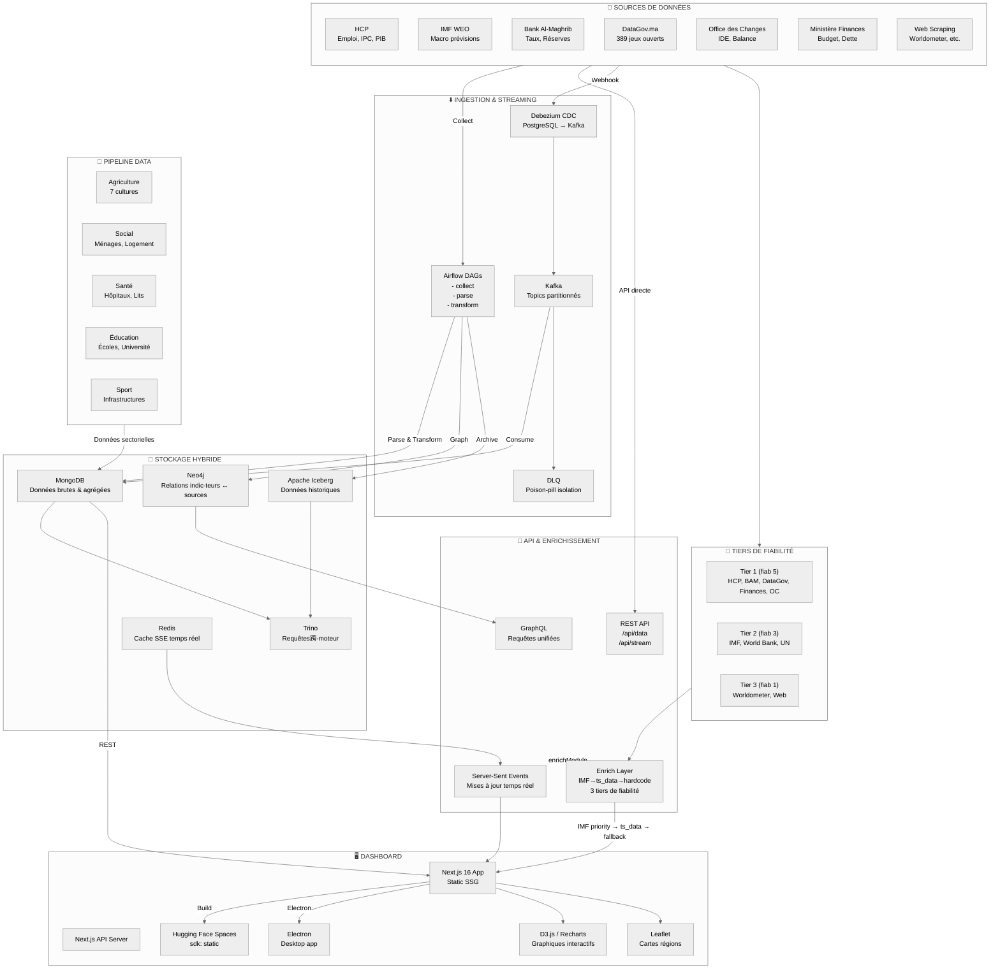

# Dashboard Économie Maroc — RASD

> **R**echerche, **A**nalyse et **S**ynthèse des **D**onnées — Portail macroéconomique du Maroc

Tableau de bord interactif avec pipeline data hybride (MongoDB + Neo4j), ingestion temps réel (CDC Kafka), orchestration Airflow, et déploiement multi-cible (HF Spaces, Electron).



## Architecture

### Pipeline Data

| Étape | Technologie | Rôle |
|-------|-------------|------|
| **Collecte** | Airflow + API | Récupération depuis 6+ sources (HCP, IMF, BAM...) |
| **Streaming** | Debezium → Kafka → CDC | Mises à jour temps réel, poison-pill DLQ |
| **Stockage** | MongoDB + Neo4j + Iceberg | Brute → Relationnel → Historique |
| **Requêtes** | Trino | Requêtes跨-moteur MongoDB ↔ Iceberg |
| **Orchestration** | Airflow + DBT | Transformations, nettoyage, audits |

### Dashboard (Next.js 16)

| Couche | Technologie |
|--------|-------------|
| **Rendu** | Static SSG + API Routes |
| **Graphiques** | Recharts (KPIs), Leaflet (cartes régions) |
| **Temps réel** | SSE (Server-Sent Events) |
| **Déploiement** | HF Spaces (static) + Electron (desktop) |
| **Design** | Tailwind CSS, responsive |

### Enrichissement des KPIs

Les KPIs suivent une résolution par priorité :

1. **IMF WEO** — données macro-économiques officielles (croissance PIB, inflation, dette)
2. **ts_data** — séries temporelles internes (chômage HCP, SMIG, taux directeur BAM)
3. **Valeur hardcodée** — fallback dans `rasd-data.ts`

La fiabilité est pondérée par source (Tier 1 = 5, Tier 2 = 3, Tier 3 = 1).

## Modules sectoriels

- **Économie** — PIB, inflation, chômage, monnaie, finances publiques
- **Agriculture** — 7 cultures (blé, orge, maïs, agrumes, olives, maraîchage, betterave)
- **Social** — Revenus ménages, conditions de logement, pauvreté
- **Santé** — Capacité hospitalière, lits, personnel médical par région
- **Éducation** — Scolarisation, effectifs, universités
- **Sport** — Infrastructures sportives et clubs

## Pages

- `/` — Accueil avec KPIs macroéconomiques et carte interactive des régions
- `/kpi` — Liste détaillée de tous les indicateurs avec séries temporelles

## Déploiement

| Cible | URL |
|-------|-----|
| **HF Spaces** | https://ysfmo98-economie-maroc-rasd.static.hf.space |
| **Dataset** | https://huggingface.co/datasets/YsfMO98/economie-maroc-rasd |
| **Desktop** | `C:\Users\youss\Desktop\RASD-Maroc-Desktop\` |

## Développement

```bash
npm install
npm run dev     # dev server
npm run build   # static export → out/
python push_to_hf.py   # deploy to HF Spaces
```

## Sources

| Source | Données | Fréquence |
|--------|---------|-----------|
| **FMI WEO** — Avril 2026 | PIB, inflation, dette, balance courante | Semestriel |
| **HCP** | Comptes nationaux, IPC, emploi, population | Mensuel/Trimestriel |
| **Bank Al-Maghrib** | Taux directeur, réserves de change | Mensuel |
| **Ministère des Finances** | Budget, déficit, dette | Annuel |
| **Office des Changes** | IDE, balance commerciale, transferts MRE | Mensuel |
| **DataGov.ma** | 389 jeux de données open data | Variable |
