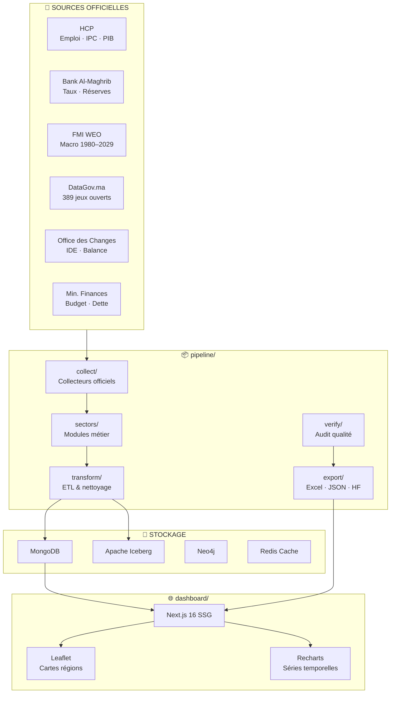

# RASD Maroc — Portail Data Macroéconomique

> **R**echerche · **A**nalyse · **S**ynthèse des **D**onnées — Maroc

Portail interactif de données économiques, sectorielles et sociales du Maroc, adossé à un pipeline data hybride (MongoDB, Apache Iceberg, Kafka CDC) et déployé en multi-cibles (Hugging Face, Electron Desktop).

---

## Structure du Projet

```
prediction-maroc/
│
├── 📦 pipeline/               # Code Python — ETL, collecte, analyse, export
│   ├── collect/               # Collecteurs officiels (HCP, BAM, Finances, OC, DataGov)
│   ├── sectors/               # Modules sectoriels métier
│   │   ├── agriculture/       # 7 cultures, production, surfaces
│   │   ├── economie/          # PIB, inflation, chômage, SMIG, taux directeur
│   │   ├── education/         # Scolarisation, universités, effectifs
│   │   ├── sante/             # Hôpitaux, lits, médecins par région
│   │   ├── social/            # Ménages, logement, pauvreté
│   │   └── sport/             # Fédérations, licenciés, médailles olympiques
│   ├── transform/             # Scripts ETL, nettoyage, ingestion Iceberg
│   ├── export/                # Génération Excel, PDF, HF Spaces push
│   │   └── imf/               # Module FMI WEO (1980–2029)
│   ├── verify/                # Audit qualité, vérification KPIs vs sources officielles
│   └── utils/                 # Utilitaires partagés (source_tiers, BigQuery, APIs)
│
├── 🌐 dashboard/              # Application Next.js 16
│   ├── src/
│   │   ├── app/               # Routes (/ accueil, /kpi indicateurs)
│   │   ├── components/        # Composants (carte, KPIs, dialogs)
│   │   └── lib/               # rasd-data.ts, data-service, data.json
│   └── public/data/           # imf.json, ts_*.json (séries temporelles)
│
├── 📊 data/                   # Données structurées
│   ├── processed/             # JSON par secteur (12 secteurs)
│   ├── raw/                   # Données brutes non transformées
│   ├── kaggle/                # Datasets Kaggle + notebooks
│   ├── regions.json           # GeoJSON des 12 régions du Maroc
│   └── source_tiers.json      # Coefficients de fiabilité par source
│
├── 🔁 dags/                   # Airflow DAGs (orchestration)
├── 🔧 dbt/                    # dbt models (transformations SQL)
├── 🏗️  infra/                  # Infrastructure (Docker, Nginx, Caddy, Trino, Monitoring)
├── 🗄️  db/                     # SQLite local
├── 🗃️  archive/                # Artefacts de travail obsolètes (conservés)
│
├── docker-compose.yml         # Tous les services (MongoDB, Kafka, Neo4j, Redis...)
├── requirements.txt           # Dépendances Python
├── Makefile                   # ← Commandes unifiées
└── README.md
```

---

## Démarrage Rapide

```bash
# Installer les dépendances
make install

# Lancer le dashboard de développement
make dev                    # → http://localhost:3000

# Build statique
make build

# Déployer sur Hugging Face Spaces
make deploy
```

---

## Architecture Pipeline



---

## Tiers de Fiabilité des Données

| Tier | Fiabilité | Sources | Type |
|------|-----------|---------|------|
| **Tier 1** | ★★★★★ (5/5) | HCP, BAM, Min. Finances, Office des Changes, DataGov.ma | Officiel national |
| **Tier 2** | ★★★☆☆ (3/5) | FMI, Banque Mondiale, ONU, OMS, FAO, UNESCO | International |
| **Tier 3** | ★☆☆☆☆ (1/5) | Worldometer, Web scraping | Web |

---

## Modules Sectoriels

| Secteur | Données clés | Source principale |
|---------|-------------|-------------------|
| **Économie** | PIB, inflation, chômage, SMIG, dette publique | HCP + FMI WEO |
| **Agriculture** | Blé, orge, maïs, agrumes, olives, betterave | HCP |
| **Santé** | Hôpitaux, lits, médecins, infirmiers | Ministère de la Santé |
| **Éducation** | Taux scolarisation, universités, effectifs | MEN + MESRS |
| **Social** | Revenus ménages, logement, pauvreté | HCP |
| **Sport** | Médailles CIO/CPI, fédérations CNOM, licenciés | CNOM + CAF |

---

## Déploiements

| Cible | URL |
|-------|-----|
| 🤗 Hugging Face Spaces | https://ysfmo98-economie-maroc-rasd.static.hf.space |
| 📦 Dataset HF | https://huggingface.co/datasets/YsfMO98/economie-maroc-rasd |
| 🖥️ Desktop Electron | `infra/electron/` |

---

## Sources de Données

| Source | Données | Mise à jour |
|--------|---------|-------------|
| **FMI WEO** (Avril 2026) | PIB, inflation, dette, balance courante 1980–2029 | Semestriel |
| **HCP** | Comptes nationaux, IPC, emploi, population | Mensuel / Trimestriel |
| **Bank Al-Maghrib** | Taux directeur, réserves de change, OPCVM | Mensuel |
| **Ministère des Finances** | Budget, déficit, dette publique | Annuel |
| **Office des Changes** | IDE, balance commerciale, transferts MRE | Mensuel |
| **DataGov.ma** | 389 jeux de données open data | Variable |
